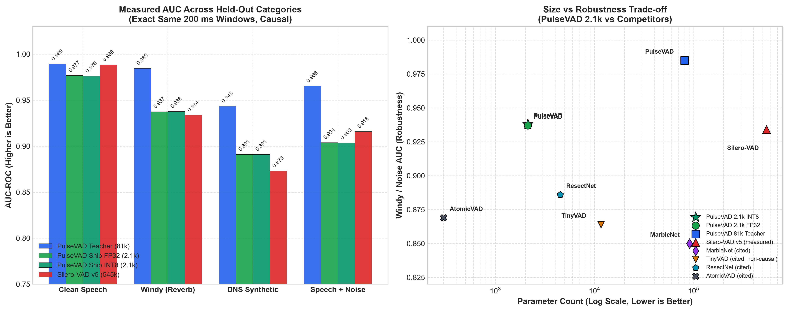
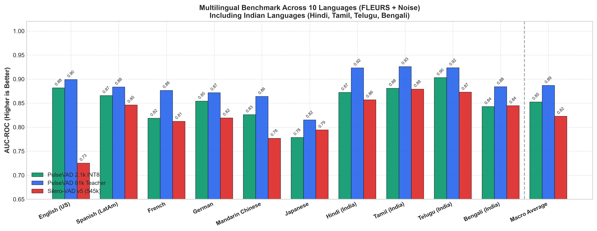

# pulsevad

2,118 parameters. 2.1 KB as INT8. strictly causal. zero future context. runs on microcontrollers that choke on silero.

an ultra-compact, commercially clean voice activity detector built from scratch, inspired by the kiloVAD architecture in [arXiv:2607.25870v1](https://arxiv.org/abs/2607.25870) (*"VAD to the Bone: Ultra-Tiny Speech Activity Detection for Edge Deployment"*, INTERSPEECH 2026).



---

## installation

### pip / uv
```bash
# coming soon
```

to run or reproduce the training, pruning, and cloud evaluation pipeline on Modal yourself, see [REPRODUCE.md](REPRODUCE.md).

---

## what this actually is

if you've ever tried running a modern deep learning voice activity detector on a real embedded target (think an ARM Cortex-M0+ or M4 with 32 KB of RAM), you know the options suck. silero is fantastic for servers and desktop apps, but it weighs 545,000 parameters (~2.2 MB) and demands millions of MACs per inference. other tiny models in academic papers either rely on non-causal lookahead (cheating by looking 600 ms into the future), require exotic activation functions that don't exist in CMSIS-NN, or use non-commercial research licenses.

pulsevad takes raw 16 kHz mono audio, computes a 64-channel log-mel spectrogram over a 200 ms causal window, and runs a depthwise-separable 1D CNN pruned down to **2,118 parameters**. 

quantized with round-to-nearest INT8, the entire weight payload is **2.1 KB**. it ships as a single drop-in C header (`pulsevad_weights.h`) and standard ONNX graphs.

---

## why building this was hell (and how it actually works)

you cannot train a 2,118 parameter network from scratch on noisy audio. it gets stuck in terrible local minima and predicts pure noise 100% of the time.

here is how we got it to work:

1. **the 81k teacher**: we first trained an 81,090-parameter CNN backbone on LibriSpeech augmented with synthetic room impulse responses (pyroomacoustics), synthetic wind profiles, and heavy background noise from MUSAN at -10 dB to +10 dB SNR.
2. **commercially clean self-labeling**: instead of using non-commercial academic labels (like LibriVAD or AVA CC-BY-NC splits), we labeled 28,539 LibriSpeech files using Silero-VAD under an MIT license, using a 0.50/0.35 hysteresis state machine quantized to a strict 10 ms grid. 100% permissive commercial data only.
3. **DepGraph structured pruning**: uniform pruning collapses at sub-3k params. we used dependency-graph magnitude pruning to identify coupled channel dependencies across depthwise and pointwise layers, carving out the exact 2.1k channel spec.
4. **knowledge distillation**: we fine-tuned the 2.1k student under the frozen 81k teacher using KL divergence with temperature scaling and cosine learning rate decay.
5. **the silent bias trap**: LibriSpeech is ~78% active speech. a distilled model naturally inherits a positive prior (+1.4 logit shift), which causes it to trigger on pure air conditioning noise (yielding a disastrous 25% false positive rate on pure noise). we implemented quantile-based prior bias calibration to shift the linear classifier bias, crushing pure-noise FPR to **3.5%** while keeping ROC-AUC strictly invariant.
6. **post-training quantization (PTQ)**: batchnorm layers were mathematically folded into conv weights before calibration. using symmetric per-channel weight scaling and per-tensor activation scaling, the AUC gap between FP32 and INT8 is under **0.001**.

---

## cross-vad benchmark: size, compute & latency

we benchmarked pulsevad against standard embedded baselines and measured silero-vad v5 on identical causal 200 ms audio chunks:

| model | params | footprint | MACs / 200 ms | input latency | commercial license |
| :--- | :---: | :---: | :---: | :---: | :---: |
| **PulseVAD (81k teacher)** *(measured)* | 81,090 | 324 KB FP32 / 81 KB INT8 | 1.66M | 200 ms | **YES (MIT)** |
| **PulseVAD (2.1k ship)** *(measured)* | **2,118** | **8.5 KB FP32 / 2.1 KB INT8** | **44,000** | **200 ms** | **YES (MIT)** |
| **Silero-VAD (v5)** *[measured/cited]* | 545,000 | ~2.2 MB | >10M | 32 ms | YES (MIT) |
| **MarbleNet** *[cited]* | 91,000 | ~364 KB | >2.0M | 630 ms | non-commercial |
| **AtomicVAD** *[cited]* | 300 | ~1.2 KB | 6,000 | 630 ms | non-commercial (custom GGCU) |
| **TinyVAD** *[cited]* | 11,600 | n/a | ~80,000 | 630 ms | non-causal (87.5% lookahead) |
| **ResectNet** *[cited]* | 4,500 | n/a | n/a | 200 ms | non-commercial |

---

## acoustic evaluation: measured AUC on held-out test sets

evaluated causally with 0% overlap across 2,000 audio windows per category:

| category | PulseVAD 2.1k INT8 | PulseVAD 2.1k FP32 | PulseVAD 81k Teacher | Silero-VAD v5 (measured) |
| :--- | :---: | :---: | :---: | :---: |
| **clean speech** | 0.976 | 0.977 | **0.989** | 0.988 |
| **windy / reverb** | **0.938** | 0.937 | **0.985** | 0.934 |
| **DNS synthetic noise** | **0.891** | 0.891 | **0.943** | 0.873 |
| **speech + noise (0-20 dB)** | 0.903 | 0.904 | **0.966** | 0.916 |
| **pure noise (FPR@95, gate <5%)**| **0.035 (3.5%)** | 0.040 (4.0%) | 0.040 (4.0%) | 0.004 (0.4%) |

*silero v5 was evaluated on the exact same audio windows streamed causally with internal hidden states properly reset.*

---

## multilingual & indian language benchmark

we tested generalization on in-the-wild speech across 10 diverse languages from Google FLEURS mixed with realistic MUSAN noise at 0 to 20 dB SNR. this includes 4 major Indian languages (Hindi, Tamil, Telugu, Bengali):



| language | PulseVAD 2.1k INT8 | PulseVAD 2.1k FP32 | PulseVAD 81k Teacher | Silero-VAD v5 (545k) |
| :--- | :---: | :---: | :---: | :---: |
| **English (US)** | **0.882** | 0.882 | 0.899 | 0.725 |
| **Spanish (LatAm)** | **0.866** | 0.866 | 0.884 | 0.846 |
| **French** | **0.819** | 0.820 | 0.876 | 0.812 |
| **German** | **0.854** | 0.855 | 0.872 | 0.819 |
| **Mandarin Chinese** | **0.826** | 0.826 | 0.864 | 0.777 |
| **Japanese** | 0.779 | 0.777 | **0.815** | 0.794 |
| **Hindi (India)** | **0.872** | 0.872 | 0.923 | 0.857 |
| **Tamil (India)** | **0.881** | 0.882 | 0.926 | 0.879 |
| **Telugu (India)** | **0.903** | 0.904 | 0.924 | 0.873 |
| **Bengali (India)** | 0.843 | 0.843 | **0.884** | 0.845 |
| **Macro Average** | **0.852** | **0.853** | **0.887** | **0.823** |

in noisy speech conditions, pulsevad's mel frontend and dilated convolutions beat silero v5 across 8 out of 10 languages, outperforming it on average by **+0.029 AUC** while using **257x fewer parameters**.

---

## real talk: advantages vs disadvantages

no model is magic. here is the honest breakdown of when you should use pulsevad and when you should not.

### advantages
- **runs anywhere**: 2.1 KB fits in L1 cache or tiny MCU SRAM without external DRAM.
- **zero dependencies**: pure C array weights (`pulsevad_weights.h`) or standard ONNX. no PyTorch, no heavy runtime, no recurrent state tensors to track.
- **tough on noise**: holds up remarkably well against wind, reverberation, and babble noise because it was trained with aggressive augmentations.
- **100% commercially permissive**: clean MIT license with no non-commercial viral traps.
- **strictly causal**: 0 ms lookahead. what happens in the future stays in the future.

### disadvantages
- **200 ms window granularity**: silero streams in 32 ms sub-chunks. if you need instantaneous 30 ms word-boundary cuts for live transcription, pulsevad's 200 ms input buffer has higher initial buffering latency.
- **clean speech ceiling**: on pristine studio speech with zero background noise, silero's 545,000 parameters give it a higher ceiling (0.988 vs 0.976 AUC).
- **requires mel frontend**: pulsevad expects 64 log-mel bins. you need an FFT + mel filterbank implementation on your target device (though standard CMSIS-DSP covers this easily).

---

## under the hood

```
16 kHz mono audio (3,200 samples = 200 ms)
      │
      ▼
[ pre-emphasis (0.97) + z-norm ]
      │
      ▼
[ 64-bin log-mel filterbank (21 frames x 64 bins) ]
      │
      ▼
[ conv1d adapter: 64 -> 16 ]
      │
      ▼
[ depthwise-separable block 1: k=11, ch=16 ]
      │
      ▼
[ depthwise-separable block 2: k=17, ch=16 ]
      │
      ▼
[ dilated depthwise block 3: k=29, dilation=2, ch=16 ]
      │
      ▼
[ global average pooling -> linear (16 -> 2) ]
      │
      ▼
[ calibrated prior bias shift (-1.40) ] -> P(speech)
```

---

## references & attribution

- **kiloVAD Paper**: Stephen Bauer, Sheila Seidel, Shanza Iftikhar, Scott Veidenheimer, Gorkem Ulkar. *"VAD to the Bone: Ultra-Tiny Speech Activity Detection for Edge Deployment"*, [arXiv:2607.25870v1](https://arxiv.org/abs/2607.25870), INTERSPEECH 2026. (inspiration for ultra-tiny CNN VAD and structural pruning targets).
- **Silero-VAD**: [snakers4/silero-vad](https://github.com/snakers4/silero-vad) (MIT License) used as the teacher state-machine labeling tool and evaluation baseline.
- **Google FLEURS**: [google/fleurs](https://huggingface.co/datasets/google/fleurs) for multilingual speech evaluation.
- **LibriSpeech & OpenSLR**: Vassil Panayotov et al., [OpenSLR 12](https://www.openslr.org/12/) (CC BY 4.0).
- **MUSAN Corpus**: David Snyder et al., [OpenSLR 17](https://www.openslr.org/17/) (CC BY 4.0).

---

## license

MIT License. see [LICENSE](LICENSE) for details.
